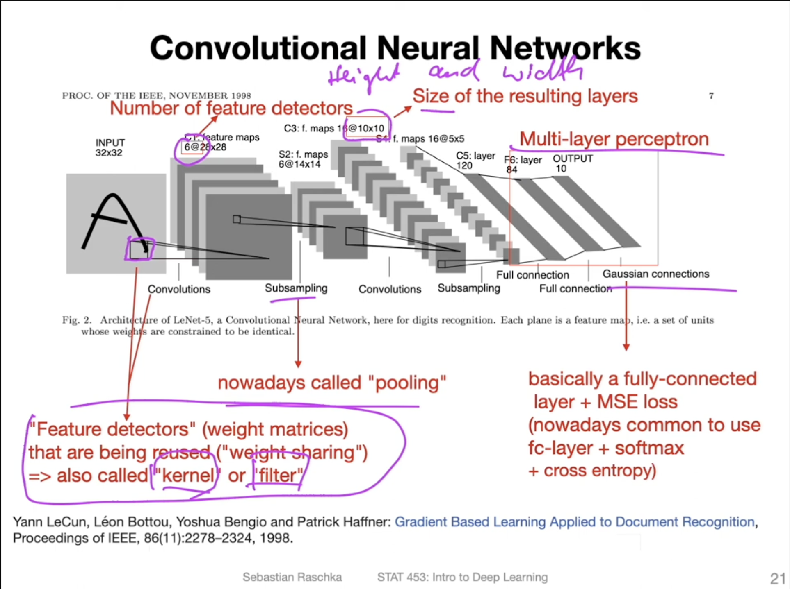

# Introduction to CNNs

- While feedforward networks assume independent features, and sequential networks assume sequential relationship, CNNs assume local feature relation.

## Intuition on the Conv layer
The CONV layer’s parameters consist of a set of learnable filters. Every filter is small spatially (along width and height), but extends through the full depth of the input volume. For example, a typical filter on a first layer of a ConvNet might have size 5x5x3 (i.e. 5 pixels width and height, and 3 because images have depth 3, the color channels). During the forward pass, we slide (more precisely, convolve) each filter across the width and height of the input volume and compute dot products between the entries of the filter and the input at any position. As we slide the filter over the width and height of the input volume we will produce a 2-dimensional activation map that gives the responses of that filter at every spatial position. Intuitively, the network will learn filters that activate when they see some type of visual feature such as an edge of some orientation or a blotch of some color on the first layer, or eventually entire honeycomb or wheel-like patterns on higher layers of the network. Now, we will have an entire set of filters in each CONV layer (e.g. 12 filters), and each of them will produce a separate 2-dimensional activation map. We will stack these activation maps along the depth dimension and produce the output volume.

## Terminology
- depth - num of channels / $C_o$
- filters / kernels / feature detectors - $K$
- activation / feature map - is the result of conv operation by one filter on input image/tensor. 
- receptive field - kernel sized portion of input image that the conv layer acts on

see [this](https://pytorch.org/docs/stable/generated/torch.nn.Conv2d.html) pytorch documentation on Conv2D for more nuanced understanding on the shapes.

- Main concepts of CNN [link](https://youtu.be/7fWOE-z8YgY?t=825)
    1. sparse connectivity: a single patch in feature map is connected to only a small patch of image (in MLPs there is dense/full connection)
    2. parameter sharing: the same kernel/filter slides across the image. ie different neurons in each activation map is calculated using the same filter. In MLPs each neuron in the output space is calculated using different weight values.
    3. many layers: combining extracted local patterns to global patterns. 

## References
- Course material [here](https://sebastianraschka.com/blog/2021/dl-course.html#l13-introduction-to-convolutional-neural-networks)  
- CS231N CNN article [here](https://cs231n.github.io/convolutional-networks/#case). Great intuition about the shapes, local connectivity, spatial arrangement, and loads of other stuff.

